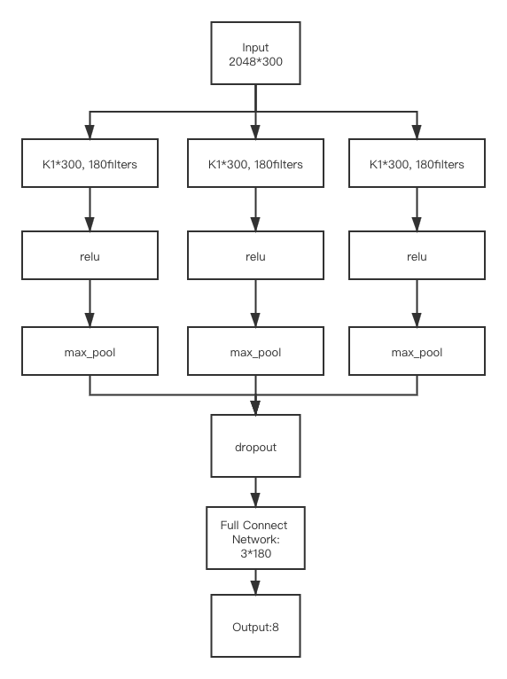
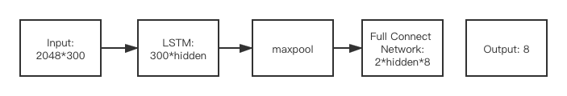
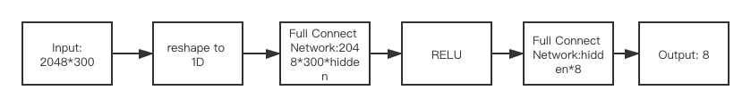

人工智能导论-情感分析

陈张萌 2017013678

[TOC]

## 概述

1. 实现了对 4570 篇新浪新闻进行情感分类。
2. 数据集：每篇文章共 8 种情感类别。
3. 实现了CNN和RNN情感分类模型，也实现了MLP作为baseline用于比较分析。
4. 支持在config.py中修改参数进行训练

## 文本处理

文本处理预训练的词向量：https://github.com/embedding/chinese-word-vectors。考虑到数据来源是搜狗新闻，所以使用其中的 Sogou News 的 SGNS (Word + Character + Ngram) 对应的词向量。

经验证，训练数据文本之间的长度差距较大，最长文本有 2400 多，最短的这只有 80 多。为了不浪费过多的讯息，采用 padding 的方法补全短的文本，最终将每篇文章的 sentence_max_length 设定为 2048，具体可以在 Config.py 中进行修改。

而每篇文章有 8 种情感分类，所以可以将该问题视作一个多分类问题。考虑到对于情感分类来说主观性较强，因此除了投票最多的情感外其他的主观性更强。因此选取人数最多的情感作为该文章的标签进行训练。

## 模型搭建

### CNN模型

- #### **模型搭建**

CNN模型采用单层CNN+全连接层实现，模型如下：

(1)输入：2048 × 300的词向量矩阵。其中，2048 为句子长度，300 为词嵌入向量维数。

(2)卷积核：将输入分别经过 n 个大小为num_filter × K × 300的卷积核(K 不同，默认值为[3, 4, 5])，再经过 RELU 激活函数。

(3)最大池化：得到 n 个长为num_filter的向量。 将他们拼接起来，就得到长为n\*num_filter的向量。再经过一个 dropout 层，dropout rate默认为0.5.

(4)全连接：最后将这一向量输入大小为nCout × 8的全连接层，得到长为 8 的向量。

- #### **训练结果**

从第55代开始，模型在测试集上的正确率稳定在55.07%，在训练集上的正确率稳定在66.28%。

### RNN模型

- #### **模型搭建**

RNN模型使用LSTM实现，模型如下：

(1)输入：2048 × 300的词向量矩阵。其中，2048 为句子长度，300 为词嵌入向量维数。

(2)双向LSTM：经过300 × H的双向 LSTM，句子中每个位置都得到一个长为 2H 的向量，因而得到2H × 2048的特征矩阵;

(3)最大池化：对 2048 这一维进行最大池化，得到长为2H的向量。

(4)全连接：经过一个大小为2H × 8的全连接层，得到长为 8 的向量。

- #### **训练结果**

从第30代开始，模型在测试集上的正确率稳定在39.67%，在训练集上的正确率稳定在46.41%。

### MLP模型

- #### **模型搭建**

MLP模型如下

(1)压缩维数：将输入的2048 × 300压为长度为 614400 的向量。

(2)全连接：经过614400 × H的全连接层，再经过 relu 函数。

(3)全连接：再经过一个H × 8的全连接层，得到长为8的向量。

- #### **训练结果**

但是MLP模型在调试时遇到了Bug，并没有真的进行训练。

## 实验结果

| 模型         | CNN    | RNN    |
| ------------ | ------ | ------ |
| **Accuracy** | 58.35% | 46.41% |
| **F-score**  | 31.32% | 7.92%  |
| **Corr**     | 33.06% | 36.99% |

### 参数设置

- #### **CNN**

| 参数          | 值      |
| ------------- | ------- |
| num_filters   | 180     |
| kernel_size   | [3,4,5] |
| emb_size      | 300     |
| dropout_rate  | 0.5     |
| learning_rate | 0.001   |

- #### **RNN**

| 参数          | 值    |
| ------------- | ----- |
| num_filters   | 20    |
| emb_size      | 300   |
| dropout_rate  | 0.5   |
| learning_rate | 0.032 |
| num_layers    | 1     |

- #### **MLP**

| 参数          | 值    |
| ------------- | ----- |
| num_filters   | 20    |
| emb_size      | 150   |
| dropout_rate  | 0.3   |
| learning_rate | 0.003 |

## 问题思考

### 实验训练的停止

我选择的方式是固定迭代次数，并保存其中验证集正确率最高的模型。

- 通过验证集调整迭代次数的优缺点

一个合理的考虑是，划分一部分验证集用于调整迭代次数，当模型在验证集上的正确率超过某一个固定值时/开始下降时，就停止迭代。这样做的好处是较为灵活，如果固定迭代次数的话，对于不同的参数，达到最佳的验证集正确率(代表着最强的泛化能力)所需的迭代次数一般是不同的。

但是该方法缺点为需要从训练数据中划出一部分做测试集，减少了可以用作训练的数据，在本次数据量较小的情况下更加突出了这个缺点。而且还有一个问题是，不好把握判断在什么时机停止训练。尤其是当加入 dropout 的时候，由于 dropout 会屏蔽一部分神经元， 有时会出现 acc 突然变小一下的情况。如果采用通过验证集调整的方式，造成的结果就是可能在一个局部最优处停止训练。

- 固定迭代次数的优缺点

固定迭代次数可以使得全部训练集中的数据都能够被用作训练，提高模型的拟合度；而且不需要考虑在什么情况下停止训练。考虑到本次实验数据规模较小，决定采用固定迭代次数的方式。

但该方法的缺点在于不能够较好的选择较好的迭代次数，容易选择到欠拟合或者过拟合的模型。针对这个问题，我采用的方式是划分验证集，验证正确率并保存最高正确率的模型。

由于数据量较小，因此可以在最开始将固定迭代次数设置较大，这样就可以最大程度确保曾经训练出一个较好用的模型。

### 实验初始化

本次实验对于全连接层的权重参数采用了 Xavier 正态初始化，偏置参数初始化为 0;对卷积层的权重参数采用了 He 。

不同初始化方法的优缺点: 

- 零均值初始化

零均值初始化可以反向传播中加快网络中每一层权重参数的收敛， 同时避免训练权重的一致性。零均值初始化的缺点是，并未考虑输入和输出的关系以及非线性函数的影响，使得容易较早出现梯度消失。

多适用于图像处理，可以提高训练速度。 

- 高斯初始化

高斯初始化存在多种方式，常见的有 Xavier 初始化和 He 初始化。

Xavier 可以保持每一层的梯度大小都差不多相同，使得输入输出分布一致。在层数较多时它让每一层的权重参数的方差都很小，能够减缓梯度消失或梯度爆炸。在全连接层普遍采用，效果较好。Xavier初始化的缺点在于，没有考虑非线性激活函数对输出数据分布的影响。

He 初始化在 Xavier 的基础上，考虑了激活函数对输出分布的影响，使得输入输 出分布一致。He 比较适合 relu 作为激活函数的情况，而本次实验紧跟着卷积层的激活函数正是 relu，故采用了这种初始化方式。

### 过拟合

本次实验由于数据量小，因此过拟合几乎不可避免。具体到本次实验中，在 CNN 中，在全连接之前增加了一步 dropout，但如果 dropout_rate 比较高，也会导致泛化能力(表现为验证集正确率)下降。

除此之外，常用的方法还有:

- 在损失函数中加入 L2 正则化项
- 调整网络结构
- 增加训练数据量
- 控制训练迭代次数

### 三种模型的优缺点比较

| 模型 | 优点                                        | 缺点                                     |
| ---- | ------------------------------------------- | ---------------------------------------- |
| CNN  | 参数较少，收敛比RNN快，容易实现局部特征提取 | 不易调参                                 |
| RNN  | 参数较少，实现较长距离信息传递              | 收敛较慢                                 |
| MLP  | 收敛速度快，效果还行                        | 参数超多，容易过拟合、梯度爆炸、梯度消失 |

## 实验总结

1. 本次大作业熟悉了 pytorch 的使用以及处理数据、构建神经网络模型、并进行训练和调参，总的来说收获还是非常大的。
2. 实验数据当中的“愤怒”标签实在是太多了······
3. 我对神经网络一点也不熟悉，本次作业在数据预处理、神经网络搭建以及训练、调参方式等等方面得到了非常多同学的指导和帮助：徐易、杨雅儒、禹含、宋浩轩、王荻、田卓钰、刘丰源等等，感谢我的好朋友们。